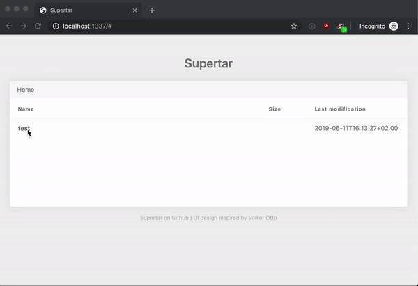

# Supertar is TAR on steroids with compression, encryption and web-interface

Supertar (short star) combines archiving, compression and encryption but makes it easy to list, search, add or remove new files and directories without first decrypting and decompressing the archive. Trough a built in web-interface, you can browse an archive, view and extract single files.

We all know TAR. It's a great tool to archive a lot of files. You can later compress and encrypt your archive. But if you want to search for, extract, add or delete a specific file or directory you have to decrypt first and then decompress the archive. This is a cumbersome process. Supertar to the rescue.

Supertar is a work in progress. Test it carefully if you want to use it in production.

## Installation

```
go get github.com/marcboeker/supertar
```

And make sure, that your `$PATH` env variable includes `$GOPATH/bin`. You can add the following snippet to your `.bashrc`, `.zshrc` or whatever you are using:

```
export PATH="$PATH:$GOPATH/bin"
```

After running `source ~/.bashrc` or `source ~/.zshrc` you can run the `supertar` command:

```
supertar --help
```

## Built-in web server? Why?

Imagine you have an archive with some images and videos. They are named IMG_1234.jpg and MOV_4321.avi. You are searching for a specific image, but don't know the exact name. Just start the Supertar web-server with the archive file and you can browse the archive and click on each image or video to directly show them in your browser. This is much mor comfortable than extracting the whole archive to find what you are looking for.



The built-in server detects the mime type and adds a streaming capability (for browser supported formats), so that you can skip in videos or audio files.

TODO: Maybe we're adding a gallery feature later, to make it even simpler.

## Examples

```
# Create a new archive with compression and 4MB (default) chunk size
supertar create -cf foo.star /home/cnorris

# Create a new archive with compression and 16MB chunk size
supertar create -cf foo.star --chunk-size 16777216 /home/cnorris

# List all files in the archive
supertar list -f foo.star

# List all jokes in the archive
supertar list -f foo.star home/cnorris/jokes/*

# Add a new joke to the archive
supertar add -f foo.star /home/cnorris/jokes/world-domination.txt

# Remove a joke from the archive
supertar delete -f foo.star /home/cnorris/jokes/very-bad-one.txt

# Compact archive after deletion of items
supertar compact -f foo.star

# Serve an archive through the built in web-interface at http://localhost:1337
supertar serve -f foo.star

# Update the password of the archive
supertar update-password -f foo.star
```

## Wait, what? How does it work?

Supertar compresses and encrypts every item on its own and then appends it to the archive. Searching for a file iterates over the archive and jumps from item header to item header to skip the file body. This enables super fast listing and extracting of files. 

If you want to add one or more files, Supertar appends a compressed and encrypted version of the file at the end of the archive.
Deleting a file toggles the delete flag in the appropriate header for the given file. To reclaim space, Supertar offers a compact command, to remove all deleted items from the archive file.

## Under the hood

Supertar uses Zstandard (level 5) for compression and Chacha20+Poly1305 for AEAD. The encryption key is derived from the users password using Argon2id.

## Encryption and key management

When an archive is created, a random 256 bit key is generated using `crypto.rand`. This key is the encrypted with Chacha20 using another key, that is derived from the users password using Argon2id and a generated salt. The key is also authenticated using Poly1305.

Argon2id is used with the following parameters time=1, memory=64mb and 4 threads. 

This enables the user to change the password of an archive without reencrypting it.

## Supertar file format

Supertar has a simple file format that can be read easily by your own parser. So there is no vendor lock in.

```
<Archive>
    <Header>
        -> Magic number [0] (4 bytes)
        -> Version number [1] (1 byte)
        -> Compression enabled and algorithm [2] (1 byte)
        -> Chunk size in bytes (min. 64kb) (8 bytes)
        -> KDF salt (16 bytes)
        -> Key nonce (16 bytes)
        -> Random key + MAC (48 bytes)
    <Items 0..n>
        <Item>
            <Header>
                -> Length of path (2 bytes)
                -> Path (n bytes)
                -> Size (8 bytes)
                -> Number of chunks (8 bytes)
                -> Mtime (8 bytes)
                -> Mode [3] (4 bytes)
                -> Deleted flag (1 byte)
            <Chunks 1..n>
                <Header>
                    -> Sequence number (4 bytes)
                    -> Chunk size (4 bytes)
                <Body>
                    -> Compressed and encrypted item (n bytes)
```

`[0]` The magic number is always `1337`  
`[1]` The version numer is currently `1`  
`[2]` The compression flag is either `0` to disable compression or `1` to enable compression using Zstandard. More compression algorithms will be added later.  
`[3]` Mode contains the file mode and the permission bits.